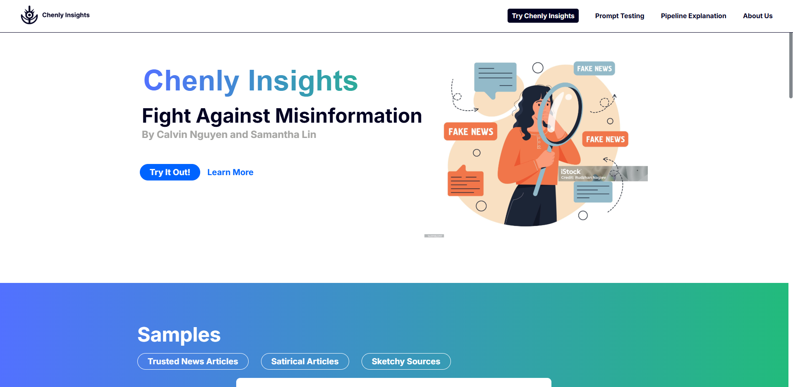

# GenAI for Good: The Misinformation and Veracity Engine
## By Calvin Nguyen, Samantha Lin, Dr. Arsanjani
## Our Info
Calvin Nguyen: <a href = "https://www.linkedin.com/in/calvin-nguyen-data/"> Linkedin </a> | <a href = "https://github.com/Neniflight"> Github </a> \
Samantha Lin: <a href = "https://www.linkedin.com/in/calvin-nguyen-data/"> Linkedin </a> | <a href = "https://github.com/Samanthalin0918"> Github </a>

* TOC
{:toc}

## Abstract
 \
The objective of our product, Chenly Insights, is to help users combat misinformation using factual factors and microfactors. As misinformation gets easier to spread due to deep fakes and large social networks, this project empowers users by giving them a veracity (truthness) for the news they receive through a Mesop interface. A user will link and upload a news article of their choice. Then, two different types of AI, generative and predictive, judge the article on appropriate factuality factors. The scores are accumulated and then shown to the user, along with other visualizations related to the article. In addition, these scores, along with metadata related to the article, will be uploaded to a vector database that generative AI can use. This vector database is constantly updated with new information from fact check and news websites. Users can also converse with the AI and ask questions about each article and why a particular score was given. We also found the best prompting types with adjustments to the prompts that gives the highest accuracy.

## Dataset
We utilized multiple different data sources to both establish the ground truth and understand factors that indicate misinformation. Generally, the more context and information you give a large language model, it can give more nuanced and thoughtful judgements on a piece of text. The data is as follows: 
* **Liar Plus Dataset**: A publicly available dataset containing labeled statements from news sources with contextual information. After preprocessing, we have a dataset of 10,234 rows and 15 columns, with a key truthness labels **six levels from "pants-on-fire" to "true"**. Primarily used in our vector database and predictive AI training.
* **Politifact Factchecks**: A website that factchecks articles and statements made by leaders. Used to help set the ground truth of a topic.
* **User-Selected PDFs**: Article links or PDFs are analyzed with this engine and assigned a truthness label afterwards.
* **SERP API Search Results**: Google search results based on the title of the user-selected articles to provide the veracity engine with more information.
* **Factuality Factors**: These factors determine the veracity of an article and we analyze four of them for each article: sensationalism, stance detection, social credibility, naive realism. 

## Flowchart
Our flowchart in Lucidchart showcasing the data journey thorughout this process. 

<iframe allowfullscreen frameborder="0" style="width:960px; height:720px" src="https://lucid.app/documents/embedded/7babda6c-da85-49d9-bb0c-83fd85deffdf" id="rMtVwZ9NMd.z"></iframe>

## Generative AI Methods

## Predictive AI Methods

## Results

## Discussion
In our project, we've attempted to follow previous work's suggestions by combining predictive and generative artificial intelligence in detecting misinformation. We successfully developed a simple hybrid system that scores articles' veracity, and this is a significant step forward in addressing the complex challenge of misinformation in a digital age. 

However, our results should be taken with a grain of salt, as there were issues. Depending on the human graders, the factuality factor score of a particular article could vary wildly. In an ideal world, we would have a commitee of misinformation experts (at least 10 for a good sample size) reading through articles and rating them. This will allow to choose the best prompting styles with proper adjustments in a more confident manner. 

## Future Direction

## Data Ethics

## Acknowledgements
Calvin and Samantha thank **Dr.Arsanjani** for his mentorship and guidance throughout this project and other groups within section B01 for debugging and advice with coding throughout the project. We would also like to thank the rest of the capstone group (David Sun, Eric Gu, Eric Sun, Jade Zhou, Luran Zhang, and Yiheng Yuan), as they helped with bouncing ideas and keeping our group accountable